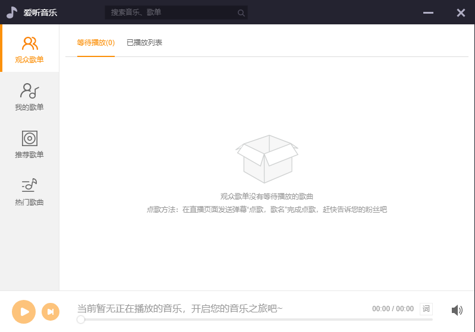
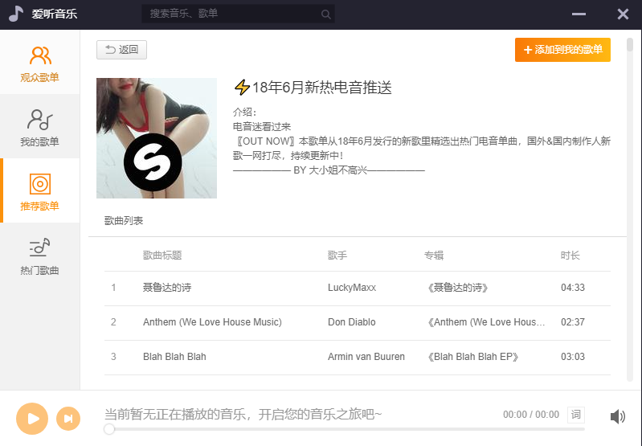
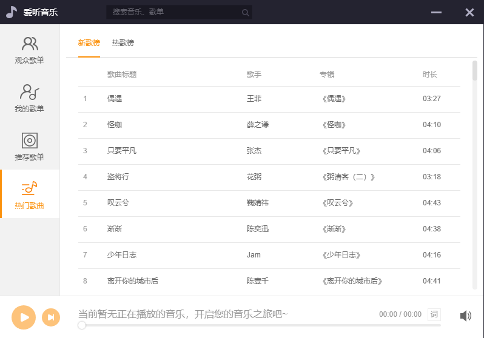
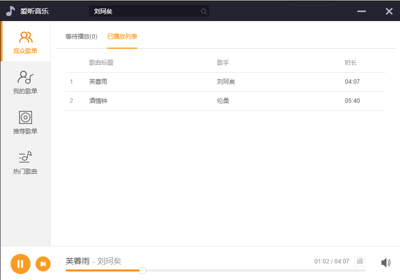
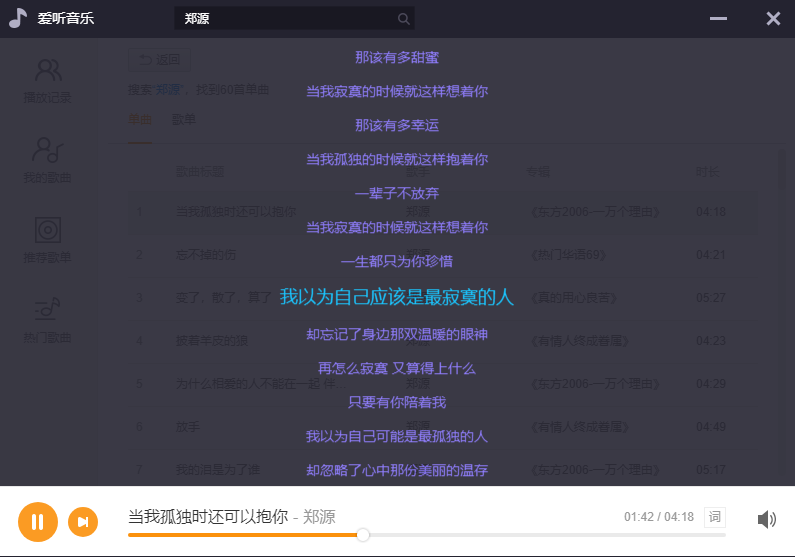

# electron-music

> 简单的音乐播放器

#### 说明

## 效果图如下：











``` bash
# 该项目只是用来无聊听听歌的，如果想看代码的话
  1.必须会 html + css + js
  2.会使用 vue, vuex
  3.了解 electron桌面框架

```

#### 安装

``` bash
# 安装项目所需要的依赖(第一次有点慢，耐心点)
npm install

# 运行项目 serve with hot reload at localhost:9080
npm run dev

# 打包项目(会在build目录下有exe安装程序和绿色版的程序) build electron application for production
npm run build

```